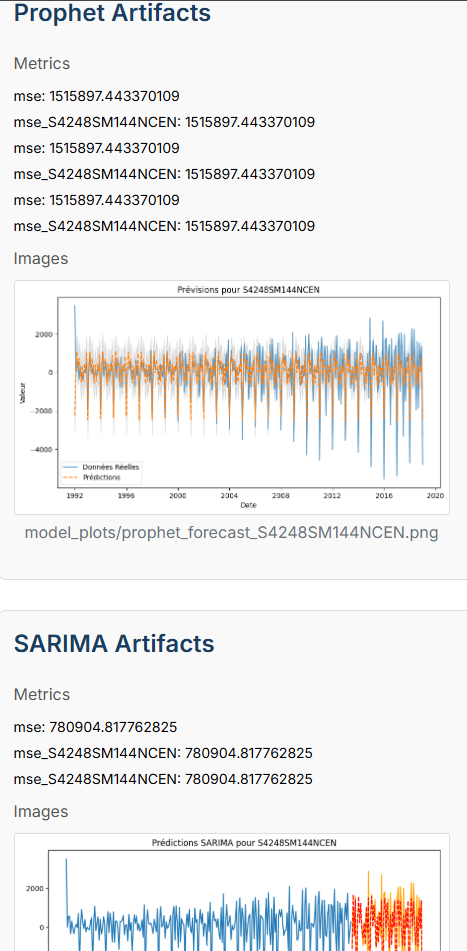

# MLEASE: Towards automated machine learning pipelines for Time-series data

## 📖 Overview

MLEASE is a **TimeSeries Forecasting Pipeline Project** designed to analyze, train, and predict time series data using various machine learning models. It features a backend built with Flask and orchestrated using **Prefect** for robust workflow management, paired with a React-based frontend for interactive visualization and control. The pipeline supports models such as SARIMA, Prophet, XGBoost, and LSTM, with integration to **MLflow** for experiment tracking and artifact management. The project is containerized with Docker, enabling consistent deployment and scalability.

<p align="center">
  
</p>

### 🚀 Key Features

- **Supported Models**: SARIMA, Prophet, XGBoost, and LSTM.
- **Prefect Orchestration**: Manages the pipeline workflow, ensuring reliable execution of EDA, preprocessing, model training, and deployment steps.
- **Real-Time Model Training**: Allows training of models on-demand with the latest data, followed by immediate deployment of the best-performing model.
- **MLflow Integration**: Tracks experiments, logs metrics, parameters, and artifacts (e.g., plots, trained models).
- **Interactive Frontend**: Built with React to upload datasets, select models, view artifacts, and make real-time predictions.
- **Docker Support**: Containerized for easy deployment across environments.
- **Deployment**: Automatically deploys the best model after training for real-time predictions.

---

## Project Structure

```
PCD-MLEASE/
├── Backend/
│   ├── authent/
│   │   ├── app.py
│   │   ├── requirements.txt
│   │   └── users.db
│   ├── datasets/
│   ├── pipeline/
│   │   ├── __pycache__/
│   │   ├── EDA.py
│   │   ├── index.html
│   │   ├── Lstm.py
│   │   ├── ModelSelection.py
│   │   ├── pipeline.py
│   │   ├── Preprocessing.py
│   │   ├── Prophet.py
│   │   ├── requirements.txt
│   │   ├── Sarima.py
│   │   └── Xgboost.py
│   ├── .dockerignore
│   ├── Dockerfile.backend
│   └── requirements.txt
├── Frontend/
│   ├── node_modules/
│   ├── public/
│   ├── src/
│   │   ├── assets/
│   │   ├── components/
│   │   ├── context/
│   │   ├── pages/
│   │   │   ├── App.jsx
│   │   │   ├── index.css
│   │   │   ├── main.jsx
│   │   │   └── styles.css
│   ├── .dockerignore
│   ├── .gitignore
│   ├── Dockerfile.frontend
│   ├── eslint.config.js
│   ├── index.html
│   ├── package-lock.json
│   └── package.json
```

---

## Prerequisites

Before running the project, ensure you have the following installed:

- **Docker** and **Docker Compose** (for containerized deployment)
- **Python (3.8-3.10)** (if running the backend locally without Docker)
- **Node.js 14+** and **npm** (if running the frontend locally without Docker)
- **MLflow Server** (running on `http://localhost:5000` for experiment tracking)

---

## Installation

### Option 1: Using Docker (Recommended)

1. **Clone the Repository**:

   ```bash
   git clone https://github.com/rayenne11/PCD-MLLEASE.git
   cd PCD-MLLEASE
   ```

2. **Set Up the MLflow Server**:

   - Start an MLflow server locally or ensure it's accessible at `http://localhost:5000`.

   - Example command to start MLflow server:

     ```bash
     mlflow server
     ```

3. **Build and Run with Docker Compose**:

   - Use the provided `docker-compose.yml` to start the backend, frontend, and Prefect orchestration:

     ```bash
     docker-compose up --build
     ```

   - This will:

     - Build and run the backend Flask app on `http://localhost:5001`.
     - Build and run the frontend React app on `http://localhost:5173`.

4. **Access the Application**:

   - Open your browser and navigate to `http://localhost:5173` to access the React frontend.
   - The backend API will be available at `http://localhost:5001`.

---

### Option 2: Running Locally (Without Docker)

#### Backend Setup

1. **Clone the Repository**:

   ```bash
   git clone https://github.com/rayenne11/PCD-MLLEASE.git
   cd PCD-MLLEASE/Backend
   ```

2. **Create a Virtual Environment**:

   ```bash
   python -m venv .venv
   .venv\Scripts\activate
   ```

3. **Install Dependencies**:

   ```bash
   pip install -r requirements.txt
   ```

4. **Start the MLflow Server**:

   - Ensure MLflow is running on `http://localhost:5000`:

     ```bash
     mlflow server
     ```

5. **Run the Backend**:

   ```bash
   python pipeline.py
   ```

   - The Flask backend with Prefect orchestration will be available at `http://localhost:5001`.

#### Frontend Setup

1. **Navigate to the Frontend Directory**:

   ```bash
   cd ../Frontend
   ```

2. **Install Dependencies**:

   ```bash
   npm install
   ```

3. **Run the Frontend**:

   ```bash
   npm run dev
   ```

---

## Usage

1. 📁 **Upload a Dataset**:
   <p align="center">  </p> 
   <p align="center">  </p> 
  
   - Navigate to the React frontend at `http://localhost:5173`.
   - Create an account.
   - Go to the "import Data" section.
   - Upload a CSV file containing time series data with column `DATE` (in `YYYY-MM-DD` format) and at least another column (the target variable).

2. 🧠 **Run the Pipeline with Real-Time Training**:
   <p align="center">  </p> 
   <p align="center">  </p> 
   <p align="center">  </p>

   - Select models to train (e.g., SARIMA, Prophet, XGBoost, LSTM) via the "Model Selection" section.
   - Start the pipeline by clicking "Create Execution".
   - Prefect orchestrates the workflow, performing:
     - Exploratory Data Analysis (EDA) and generating reports.
     - Preprocessing the data.
     - Real-time training of selected models with the latest uploaded data.
     - Evaluation and deployment of the best-performing model.

3. 📊 **View Artifacts**:
   <p align="center">  </p> 
   <p align="center">  </p> 
   <p align="center">  </p>

   - Go to the "Dashboard" page to view EDA reports, model metrics (with full precision), and plots logged in MLflow.

4. 📡 **Make Real-Time Predictions**:
   <p align="center">  </p>

   - Go to the "Deployment" page.
   - Use the deployed model to make predictions:
     - For Prophet: Enter dates as comma-separated values (e.g., `2025-01-01, 2025-02-01`).
     - For XGBoost, SARIMA and LSTM: Enter dates as a JSON object (e.g., `{"DATE": ["2025-01-01", "2025-05-01"]}`) or features (e.g., `{"lag1": [1, 2, 3], "lag2": [0.5, 1.0, 1.5]}`).
   - Click "Predict" to see real-time forecasted values.

---

## API Endpoints (Backend)

The backend exposes the following Flask API endpoints:

- `/upload_data` **(POST)**: Upload a CSV dataset.
- `/get_eda_report` **(GET)**: Retrieve the EDA HTML report.
- `/set_selected_models` **(POST)**: Select models to train (e.g., `{"selectedModels": ["Prophet", "XGBoost"]}`).
- `/serve_artifact` **(GET)**: Serve MLflow artifacts (e.g., images).
- `/get_mlflow_artifacts` **(GET)**: Retrieve MLflow artifacts (metrics, images, HTML reports).
- `/predict` **(POST)**: Make real-time predictions with the deployed model.
  - Example for Prophet: `{"model_name": "Prophet", "input_data": {"dates": ["2025-01-01", "2025-02-01"]}}`
  - Example for XGBoost: `{"model_name": "XGBoost", "input_data": {"DATE": ["2025-01-01", "2025-05-01"]}}`
- `/pipeline_status` **(GET)**: Check the current status of the Prefect-orchestrated pipeline.
- `/start_pipeline` **(POST)**: Start the pipeline with real-time training.
- `/reset_pipeline` **(POST)**: Reset the pipeline state and deployed model.

---

## Frontend Pages

- **Dashboard**: Displays MLflow artifacts, including EDA reports, model metrics, and plots.
- **Deployment**: Enables real-time predictions using the deployed model.
- **Model Selection**: Allows users to select models for real-time training.
- **Upload Data**: Interface for uploading time series datasets.

---

## Notes

- **Data Format**: The input CSV must have a `DATE` column (in `YYYY-MM-DD` format) and at least another column (the target variable).
- **Real-Time Training**: Models are trained in real-time with the latest uploaded data, and the best model is deployed automatically.
- **Prefect**: Ensures robust pipeline execution, with status updates available via `/pipeline_status`.
- **MLflow**: Tracks all experiments and artifacts; ensure the server is running at `http://localhost:5000`.
- **Deployment**: The deployed model is accessible for real-time predictions immediately after training.

---

## Contributing

1. Fork the repository.
2. Create a new branch (`git checkout -b feature/your-feature`).
3. Make your changes and commit (`git commit -m "Add your feature"`).
4. Push to the branch (`git push origin feature/your-feature`).
5. Open a Pull Request.
